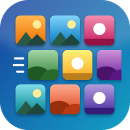

  

<h1 align="center">Objects Slideshow</h1>

  Grids of images scrolling across the screen, with camera-like effects. 
  A free app for Windows 10 / 11 (64-bit).

  <a href="https://namtpham.github.io/objects-slideshow-app/"><b>Website</b></a> ·
  <a href="https://github.com/namtpham/objects-slideshow-app/releases/latest"><b>Download</b></a> ·
  <a href="https://namtpham.github.io/objects-slideshow-app/#whats-new">What's new</a> ·
  <a href="https://namtpham.github.io/objects-slideshow-app/#feedback">Feedback</a> ·
  <a href="https://buymeacoffee.com/namtpham">Buy me a coffee</a>

## What it is

Pick a few *objects* (a cat, a car, a cup, anything), give each a folder of
images or let the app download them, and the app fills the screen with rows of
those images moving in any of 8 directions. Each object can get its own
**camera effects**, so the pictures look like a real camera filmed them:

- zoom and pan, rotation, perspective, camera shake
- motion blur, defocus, lens distortion, low resolution, compression
- color and exposure, noise, flicker, glare, fog / rain / dirt, partial view, patches covering the image

## What it is for

- **Testing vision systems**: show a camera or a model many images of an object, moving and
  degraded in controlled ways, for as long as needed. Record the show as a video to repeat a test.
- **A moving photo wall**: your own photos scrolling on a second screen, a TV or a display.
- **Something nice to look at**: a screensaver mode is planned.

## Highlights

- Smooth: up to 60 fps; effects run in their own process.
- Light: pauses when its window is hidden; memory stays flat in long runs.
- Display modes: one object at a time, a random mix, or one object per row / column.
- Export video (H.264) and Capture (a PNG of what is on screen).
- Editor mode: click images on the screen to delete them or edit them in Paint.
- Presets, a speed schedule, transitions, flip / mirror / rotate, fullscreen on the monitor you choose.
- Image downloads from DuckDuckGo and Bing, with duplicates skipped. No account or key needed.
- Updates itself (Help > Check for updates > **Update now**), keeping your images and settings.

See [what 2.0 does better than 1.x](https://namtpham.github.io/objects-slideshow-app/#better)
(frame rate, CPU, memory, preparing images, downloads).

## Get it

1. Download one of the two zips from the [latest release](https://github.com/namtpham/objects-slideshow-app/releases/latest):
   - `..._folder.zip`: starts faster, flagged less often by antivirus programs (recommended)
   - `....zip`: a single exe, simple to move around
2. Unzip it anywhere you can write to (not Program Files) and start `Objects Slideshow.exe`.

Windows may say "Windows protected your PC" for a new app: click **More info > Run anyway**.
The app is portable: settings, images, presets, videos and pictures stay in its folder.

## Feedback

Questions, ideas and bug reports: use the [form on the website](https://namtpham.github.io/objects-slideshow-app/#feedback)
(no account needed) or [open an issue](https://github.com/namtpham/objects-slideshow-app/issues/new).

---

This repository holds the app's website and its releases (the app's source code is not public).
The video and screenshots on the website are in [media/](media/).

Made by [Pham Thanh Nam](https://namtpham.github.io/). Like it? [Buy me a coffee](https://buymeacoffee.com/namtpham).
